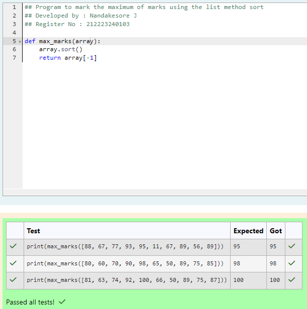
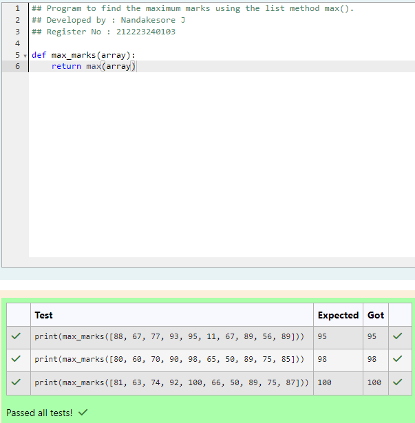
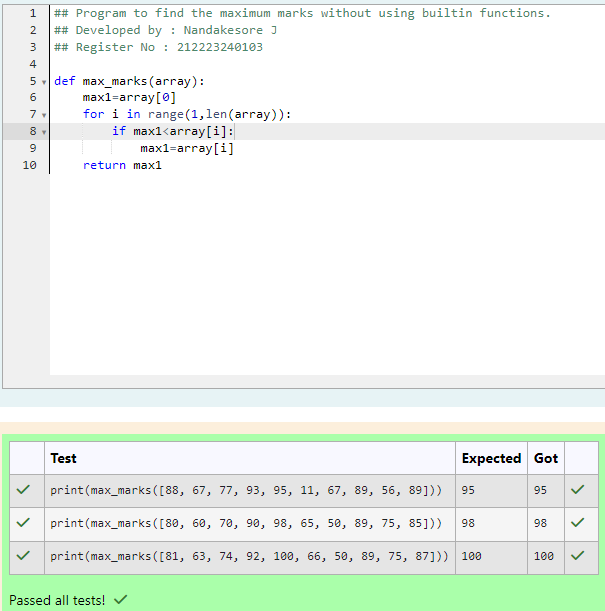

# Find the maximum of a list of numbers
## Aim:
To write a program to find the maximum of a list of numbers.
## Equipment’s required:
1.	Hardware – PCs
2.	Anaconda – Python 3.7 Installation / Moodle-Code Runner
## Algorithm:
1.	Get the list of marks as input
2.	Use the sort() function or max() function or use the for loop to find the maximum mark.
3.	Return the maximum value
## Program:

### To find the maximum of marks using the list method sort.
```
## Program to mark the maximum of marks using the list method sort
## Developed by : Nandakesore J
## Register No : 212223240103

def max_marks(array):
    array.sort()
    return array[-1]
```

### To find the maximum marks using the list method max().
```
## Program to find the maximum marks using the list method max().
## Developed by : Nandakesore J
## Register No : 212223240103

def max_marks(array):
    return max(array)
```

### To find the maximum marks without using builtin functions.
```
## Program to find the maximum marks without using builtin functions.
## Developed by : Nandakesore J
## Register No : 212223240103

def max_marks(array):
    max1=array[0]
    for i in range(1,len(array)):
        if max1<array[i]:
            max1=array[i]
    return max1
```


## Output:







## Result:
Thus the program to find the maximum of given numbers from the list is written and verified using python programming.
